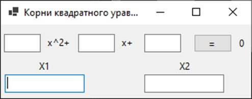

# Как пользоваться программой по нахождению корней квадратного уравнения
<div style="width: 100%;">
    
</div>

## Меню
1. Интерфейс приложения
1. Какие квадратные уравнения можно записать и какие корни можно получить
   1. Действительные корни
   1. Мнимые корни
1. Код программы
## Интерфейс приложения

Интерфейс приложения написан на **winforms** и работает исключительно в ОС ***Windows***

Интерфейс приложения


>Здесь каждое 
## Код программы
```C#
   int a = Convert.ToDouble(A.Text);
   int b = Convert.ToDouble(B.Text);
   int c = Convert.ToDouble(C.Text);
   X1.Text = root1;
   X2.Text = root2;
   public string root1{ 
        get{
            double D = b * b - 4 * a * c;
            return D >= 0 ? ((-b + Math.Sqrt(D)) / (2 * a)).ToString():$"{-b / (2 * a)} + {Math.Sqrt(-D) / (2 * a)}i";
        } 
    }
    public string root2
    {
        get
        {
            double D = b * b - 4 * a * c;
            return D >= 0?((-b - Math.Sqrt(D)) / (2 * a)).ToString(): $"{-b / (2 * a)} - {Math.Sqrt(-D) / (2 * a)}i";
        }
    }
```
